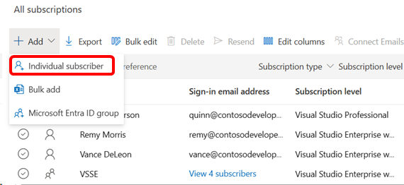
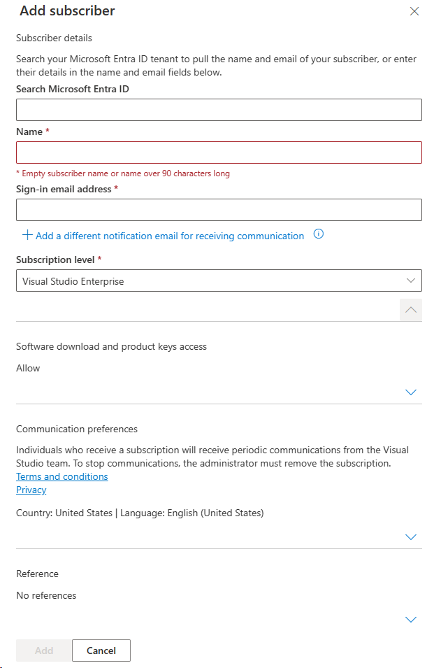

# Assign licenses in the Visual Studio Subscriptions Admin Portal

As a Visual Studio Subscriptions administrator, use the Visual Studio Subscriptions Admin portal to assign subscriptions to individual users and groups. Assign subscriptions one at a time or upload subscriber information by using the [Bulk add](assign-license-bulk.md) feature. If your organization uses Microsoft Entra ID, you can assign subscriptions by using [Microsoft Entra groups](./assign-license-bulk.md#use-entra-id-groups-to-assign-subscriptions).

## Add a single subscriber

Watch the video or read on to learn how to assign a Visual Studio Subscription to a new user and grant access to subscription benefits.

> [!VIDEO https://medius.microsoft.com/Embed/video-nc/b28f7c0a-74b9-450f-b3b6-9a6c3489b105?r=903677913064]

1. Sign in to the [Visual Studio Subscriptions Admin portal](https://manage.visualstudio.com).
1. At the top of the table, select **Add**, then select **Individual subscriber**.
   > [!div class="mx-imgBorder"]
   > 
1. A fly-out panel appears. Enter the new subscriber's information in the form fields. 
   + If your organization uses Microsoft Entra ID, enter the subscriber's name in the **Search Microsoft Entra ID** box. The search returns matching Microsoft Entra group members. After you select a user, the sign-in email and notification email fields populate automatically. 
   + If you don't find the subscriber in your organization, enter the subscriber's name in the **Name** field. 
   + Enter the email address the subscriber uses to sign in. To use a different notification email address, select the **Add a different notification email for receiving communication** link. Subscribers and administrators receive important subscription-related emails from Microsoft at that address.
      > [!div class="mx-imgBorder"]
      > 

      > [!NOTE]
      > To view members of a Microsoft Entra tenant when you enter a subscriber name, you must be a member of that tenant. 
   + Select the subscription level you want to assign to the user. The list contains only the subscription levels purchased as part of your agreement.  
   + To allow software downloads, leave the downloads toggle enabled in the **Download Settings** section. If you disable downloads, the user can't access software downloads or product keys. The subscriber still has access to all other subscription benefits.
     > [!div class="mx-imgBorder"]
     > 

   + To add reference notes to the subscription, use the **Add reference** section.
      > [!div class="mx-imgBorder"]
      > 

   + When you're done entering the subscriber's information, select **Add** at the bottom of the **Add Subscriber** fly-out.
      > [!div class="mx-imgBorder"]
      > 

## Why use a different notification email address?

Some organizations configure their email services to block incoming emails from other domains. As a result, subscribers and administrators miss important communications:
  + Subscribers don't receive a notification when you assign a subscription to them. They might also be unable to activate some included benefits. 
  + Subscribers assigned Visual Studio Subscriptions with GitHub Enterprise don't receive the invitation to join your GitHub organization. They can't access GitHub because they **must accept the emailed invitation** before they gain access to your GitHub organization. 
  + Administrators aren't notified when you add them to an agreement. They don't receive monthly administrator statements or notifications about feature changes that affect subscription management.

Using a notification email address allows subscribers to receive important subscription communications without changing their sign-in email addresses. 

## Resend assignment emails

After you add a subscriber, the system automatically sends an assignment email with further instructions. To resend the assignment email, select one or more subscribers, then select **Resend** from the top menu. When you select **Resend**, a confirmation dialog appears. Review the selected subscribers, then confirm that you want to resend the assignment email. 

## Resources

Need help? Contact [Visual Studio Subscriptions support](https://aka.ms/vsadminhelp).

## See also

+ [Visual Studio documentation](/visualstudio/)
+ [Azure DevOps Services documentation](/azure/devops/)
+ [Azure documentation](/azure/)
+ [Microsoft 365 documentation](/microsoft-365/)
+ [Microsoft Entra documentation](https://learn.microsoft.com/entra/)

## Next steps

Have lots of users to add? Learn how to assign subscriptions to [multiple subscribers](assign-license-bulk.md).
